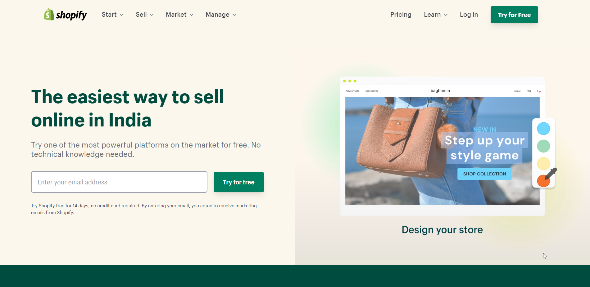

# Shopify-Clone  

[Live Link](https://shopify-landingpage.netlify.app/)

This is basically a clone of [Shopify](https://shopify.com/) made purely in HTML5 and tailwind css a utility first css Framework
Hope you like my project !!

## 🛠 Technologies Used
  - HTML - Hyper Text Markup Language
  - Tailwind css - A Utility First Framework of CSS
  - CSS - Cascading Spread Sheet

## 📝 Features

- Royalty Free Images used
- Hover Effect
- Beautifull UI/UX Design
- Clone Website
- Hosted on Netlify and set up in production
- Fully Responsive in all screens

## 🤔 What i have learnt By working on this project
1. Got a good feel of tailwind utility first framework and mobile first design

## 😌 Honest Time to finish the project

I had took about 5hrs 43min.

